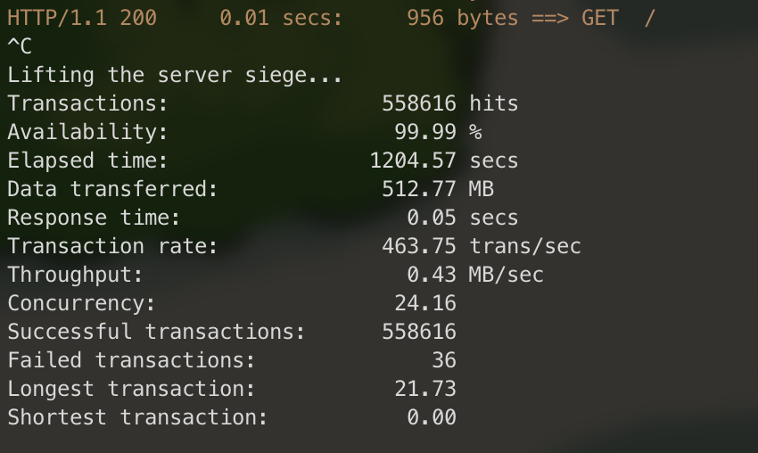

# Webserv

42Seoul Webserv Project [klim, sehyan, suhshin]

| klim                             | sehyan                               | suhshin                                |
| -------------------------------- | ------------------------------------ | -------------------------------------- |
| @PIut0                           | @ash0814                             | @rkskekzzz                             |
|  |  |  |

# Introdution

**web server like nginx!**

### server spec

- Multiplexing IO
- Configuration file
- CGI process
- HTTP/1.1 Protocol
- Light Weight
- Status Logger




# Useage

Anyone can use this server! Folllow this step!

```shell
git clone https://github.com/piut0/webserv
cd webserv
make
./webserv config_example.config
```

You are free to edit the config file at will.
However, the following must be observed.

```
server { # There must not be a newline between the server and parentheses. It must be a single space.

	server_name default; # semicolon is required
	listen 8176 127.0.0.1; # server block need single indent(\t)

	location / { # root location block is required
		allow_methods GET; # location block need double indent(\t\t)
		root ./;
		index index.html index2.html;
		auto_index on;
		cgi_info .bla ./cgi_tester;
	}
```

# Convention

Refer to the Google Style Guide.

## Variable

### Common Variable

```cpp
int snake_case_variable;
std::string snake_case;
```

### Constant Value

```cpp
const int kConstantValue = 42;
const int kVersion1_0_3 = 0;
```

### Class Data Members

```cpp
 private:
  int value_; // underscore at end.
```

### Struct Data Members

```cpp
  // static, non-static 구별없이 common과 동일
  int some_int;
  static std::string some_string;
```

### Enum Data Members

```cpp
enum UpperCamalCase {
  // 'k'를 앞에 붙인 lowerCamelCase, like const value
  kLikeConstValue = 0,
  kSomeValue
}
```

## File And DataStructure

### File Name

```cpp
// 클래스를 정의하고 있는 파일
ClassFile.hpp
// 클래스를 구현하고 있는 파일
ClassFile.cpp
// 일반 헤더 파일
generalFile.hpp
// 일반 구현 파일
generalFile.cpp
```

### Class Name

```cpp
class UpperCamelCase
{
// 접근지정자는 half indent
 public: // public 접근지정자가 있다면 클래스 정의부 최상단에 위치한다.
 protected: // protected 접근지정자가 있다면 public 정의부 다음에 위치한다.
 private: // private 접근지정자가 있다면 protected 정의부 다음에 위치힌다.
};
```

### Struct Name

```cpp
struct UpperCamelCase
{
}

```

### Enum Name

```cpp
enum UpperCamalCase
{
}

```

## Function

```cpp
void UpperCamelCase();
int AnotherFunction(std::string param);
```

## Spacing

### Common Spacing

```cpp
<- no tab with out of scope
  <- one tab with inside(one tab is 2 space)
 <- half tab with access modifier
```

### Conditionals

```cpp
if^(condition)^return^true // OK
if^(condition)^{^return^true^} // OK
if^(condition)^{ // OK
}^else^{
}
for^(int i = 0^;^condition^;^job^)^{ // OK
}

```

```cpp
switch (var) {
  case 0: {  // 2 space indent
    ...      // 4 space indent
    break;
  }
  case 1: {
    ...
    break;
  }
  default: {
    assert(false);
  }
}
```

### Loops

Braces are optional for single-statement loops.

```cpp
for (int i = 0; i < kSomeNumber; ++i)
  printf("I love you\n");

for (int i = 0; i < kSomeNumber; ++i) {
  printf("I take it back\n");
}
```

Empty loop bodies should use either an empty pair of braces or continue with no braces, rather than a single semicolon.

```
while (condition) {
  // Repeat test until it returns false.
}
for (int i = 0; i < kSomeNumber; ++i) {}  // Good - one newline is also OK.
while (condition) continue;  // Good - continue indicates no logic.
```

## Pointer & Reference, etc...

### 대입연산

```cpp
x = *p;
p = &x;
x = r.y;
x = r->y;
```

### 선언

```cpp
// These are fine, space preceding.
char *c;
const std::string &str;
int *GetPointer();
std::vector<char *>

// These are fine, space following (or elided).
char* c;
const std::string& str;
int* GetPointer();
std::vector<char*>  // Note no space between '*' and '>'
```

### Returns

Do not needlessly surround the return expression with parentheses.

```cpp
return result;                  // No parentheses in the simple case.
// Parentheses OK to make a complex expression more readable.
return (some_long_condition &&
        another_condition);
```
